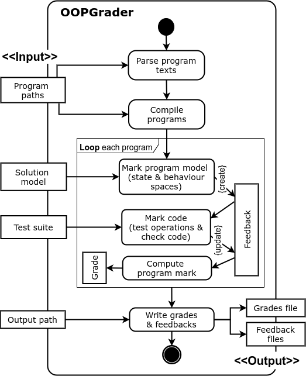
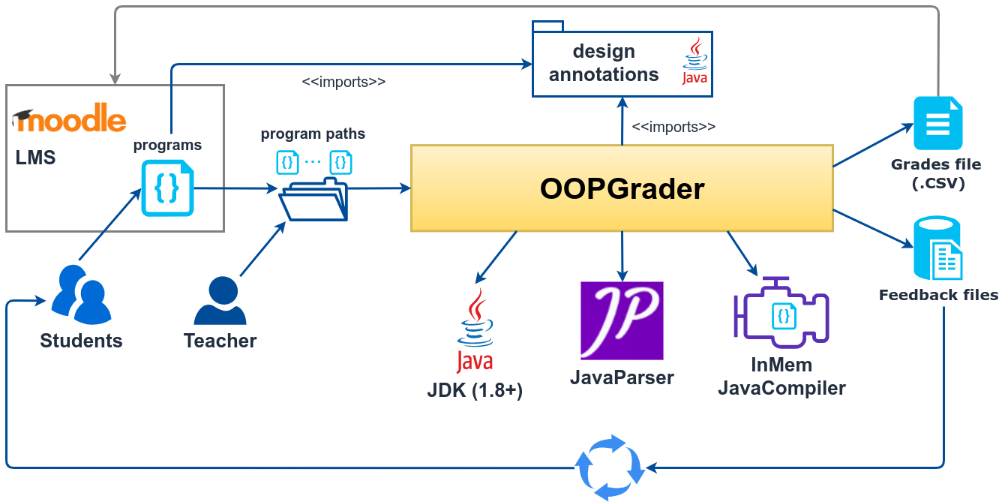

# OOPGrader: Model-Based Automatic Grading of Object Oriented Programming Assignments

It takes a set of program files, mark their design and code and produce detailed marking reports for the programs. 
The tool is configurable with a range of parameters, including solution program model, test suite, and the marking function.
A nice feature of the tool is that it comes with an Eclipse Plugin that makes it easy for teachers and students to use the tool. 
Teachers use the plugin to grade programs, while students use it to validate the assignment model when working toward the final program design.

## Architectural Overview

### UML activity model

Figure 1. UML activity model showing the high-level design logic of OOPGRADER.

Figure 1 presents the high-level grading logic of OOPGrader. 
As shown in the figure, grading takes as input a set of (assignment) program paths, the solution program model, a test suite and the output path. It produces a set of output files: one grades file and a corresponding set of feedback files. The solution program model is prepared by the teacher and hereafter will be referred to as solution model. This model contains the expected design model of the program. It is compilable but needs not contain the actual implementation of the methods. The test suite is a JUnit test suite, which specifies the test case definition classes, one for each class in the model. The output path specifies a target folder for the output files. Each program has one grade item in the grades file and one corresponding detailed feedback file. The grades file is written in the comma-separated format, which can easily be imported into the grade book of the learning management system (e.g. Moodle).

Logically, the first grading step is to parse the program texts into code units and to compile these to produce executable units. The code units are used to mark the design and (optionally) to analyse code, while the compilation units are executed with the test data to mark the code. The next and also the core step of the tool is to actually mark each program. This step produces a program grade and detailed feedback and consists of three smaller steps. The first substep is to mark the program model embedded in the code unit. This produces the model mark and creates a feedback to record the detailed marks and feedback comments on the model elements. Model marking involves validating the state and behaviour spaces against those in the solution model. The second substep is to mark the code. This produces the code mark and updates the feedback file with the detailed marks and comments for the methods. Code marking involves running the executable unit with the test cases and recording the results. It may also involve checking the code of certain operations in the code unit that they satisfy some pre-defined behavioural conditions. The behavioural conditions are defined on the program model alone and, thus, this check does not require comparing the code unit against the solution one. An example behaviour condition that frequently appears in programming assignments is that an operation must or must not invoke another (target) method in the same code unit or in a library class. The former case is useful when the target method’s behaviour is pre-defined, which implements an essential domain logic. The latter case is useful when we do not want an assignment program to use built-in library methods of the OOPL (e.g. Collections.sort) to perform tasks that are expected to be implemented in the program.

The third substep of program marking is to compute the aggregated program grade from the model and code marks. This aggregate function supports customisable model and code weights, which can be changed for each assignment or for different assignment attempts. After all the programs have been marked, the tool writes the program grades into the grades file and also stores the program’s feedback into a file.

### High-level technical architecture

Figure 2. The technical architecture of OOPGrader.

Figure 2 displays the technical architecture of the OOPGrader. 
It describes the compoments of our Java implementation of the OOPGrader’s logic shown in in the paper. We used Java version 1.8 in the implementation and have recently tested the tool with with later JDK versions. Two key open source third-party libraries that were used are JavaParseri (version 3.2.5) and an in-memory Java compilerii (version 0.3). We used the former to parse the program source code and the latter to programmatically compile the source code. All parsing and compilation outputs from these components are captured and written into the appropriate sections of the mark report. We used the Moodle learning management system (LMS) to ease the management of the student submissions of each attempt and the corresponding grades. 
First, a student prepares a requested Java program, packages it in a single ZIP-compressed file and submits to the LMS. If required, this program must use the design annotations that have been made available by the teacher on the LMS. Further, the submitted file needs to conform to a file naming pattern that includes the assignment number and the LMS username of the student. After the deadline of an attempt, the teacher download all the submitted files and extract them into an input folder (similar to the one used in the Eclipse plugin of the tool). At grading, the tool relies on the file naming pattern to find in the input folder all the program paths. These paths become the actual input for grading. The tool imports the same design annotations used by the programs to analyse and grade the program structure. The two outputs of the tool are handled as follows. The CSV-formatted grades file, which contains the user names and grades of all the submissions, are imported directly into the LMS’s gradebook. The feedback files are returned to the students via a designated folder on the LMS. This could then initiate a resubmission cycle as explained in the paper.

## Installation instructions

## Using OOPChecker

## Using OOPGrader