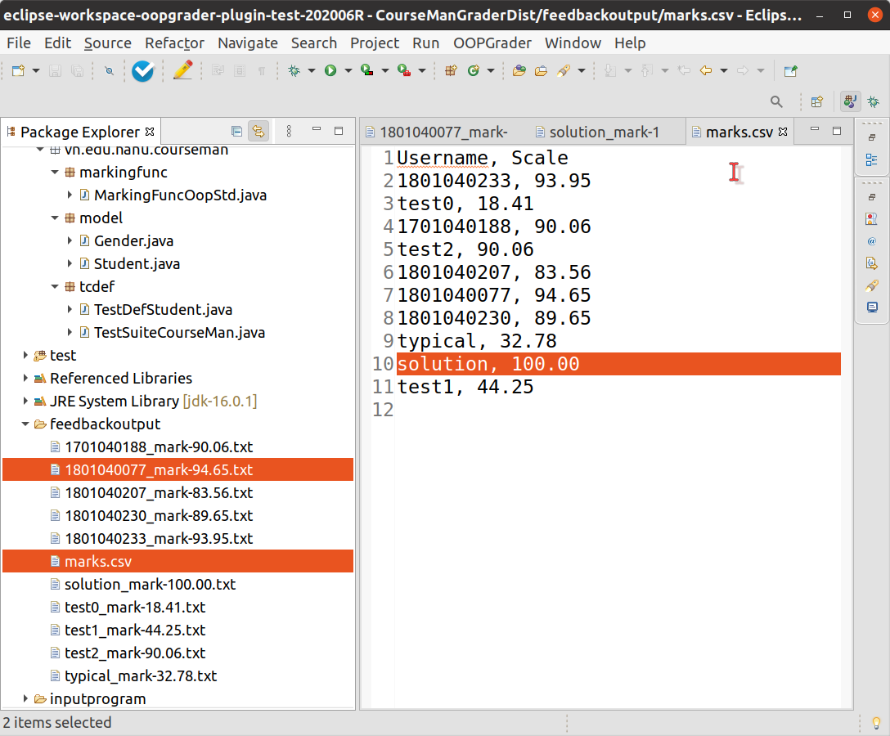

OOPGrader: Model-Based Automatic Grading of Object Oriented Programming Assignments
========

| Author | Version | Date 
| :--: | :--: | :--: |
| [Duc Minh Le](mailto:lemduc@gmail.com) | 1.0 | 03 July 2021 |

**OOPGrader** takes a set of program files, mark their design and code and produce detailed marking reports for the programs. 
The tool is configurable with a range of parameters, including solution program model, test suite, and the marking function.
A nice feature of the tool is that it comes with an Eclipse Plugin that makes it easy for teachers and students to use the tool. 
Teachers use the plugin to grade programs, while students use it to validate the assignment model when working toward the final program design.

# Architectural Overview

## UML activity model

Figure 1. UML activity model showing the high-level design logic of OOPGRADER.

Figure 1 presents the UML activity diagram that captures the grading logic of OOPGrader. 
As shown in the figure, grading takes as input a set of (assignment) program paths, the solution program model, a test suite and the output path. It produces a set of output files: one grades file and a corresponding set of feedback files. The solution program model is prepared by the teacher and hereafter will be referred to as **solution model**. This model contains the expected design model of the program. It is compilable but needs not contain the actual implementation of the methods. 

The **test suite** is a JUnit test suite, which specifies the test case definition classes, one for each class in the model. The **output path** specifies a target folder for the output files. Each program has one grade item in the **grades file** and one corresponding detailed **feedback file**. The grades file is written in the comma-separated format, which can easily be imported into the grade book of the learning management system (e.g. Moodle).

Logically, the **first grading step** is to parse the program texts into code units and to compile these to produce executable units. The code units are used to mark the design and (optionally) to analyse code, while the compilation units are executed with the test data to mark the code. 

The **next** and also the **core step** of the tool is to actually mark each program. This step produces a program grade and detailed feedback and consists of three smaller steps. The ***first substep*** is to mark the program model embedded in the code unit. This produces the model mark and creates a feedback to record the detailed marks and feedback comments on the model elements. Model marking involves validating the state and behaviour spaces against those in the solution model. 

The ***second substep*** is to mark the code. This produces the code mark and updates the feedback file with the detailed marks and comments for the methods. Code marking involves running the executable unit with the test cases and recording the results. It may also involve checking the code of certain operations in the code unit that they satisfy some pre-defined behavioural conditions. The behavioural conditions are defined on the program model alone and, thus, this check does not require comparing the code unit against the solution one. An example behaviour condition that frequently appears in programming assignments is that an operation must or must not invoke another (target) method in the same code unit or in a library class. The former case is useful when the target method's behaviour is pre-defined, which implements an essential domain logic. The latter case is useful when we do not want an assignment program to use built-in library methods of the OOPL (e.g. Collections.sort) to perform tasks that are expected to be implemented in the program.

The ***third substep*** of program marking is to compute the aggregated program grade from the model and code marks. This aggregate function supports customisable model and code weights, which can be changed for each assignment or for different assignment attempts. After all the programs have been marked, the tool writes the program grades into the grades file and also stores the program's feedback into a file.

## Checker and Grader Components
To assist student to work on the assignment in presubmission, we extract a subset of grading component to create a checker component, named **OOPChecker**. This augments the static check performed by the compiler to ensure that a program model conforms to the annotation-based metamodel. The checker is made available to students to learn the design method and to work on the assignments. We will refer to **OOPChecker** simply **as "checker"** and the **grading** **component** **as "grader"**.

## OOPChecker

Table 1. The core design rules that are used by OOPChecker

The checker only focuses on the model marking step and so it does not require the solution model. It basically checks the program model to ensure that this model has the necessary elements and the suitable annotations defined. The checker only requires two input: a program path and an output path. The logic flow is a simplified from that of the grader and the core components are also reused from the grader.

Note that the checker's feedback format differs from the grader's one. First, the feedback focuses only on the model design not the code. Second, because the design model is potentially incomplete, the feedback serves to guide the student towards completing the design. It is not meant to grade the model but to point to the relevant design rules that should be used in its construction. Table 1 lists a number of core design rules concerning the two design spaces and some example feedback comments that would be generated for the models violating those rules. Each feedback comment is specified with a condition that, if true, leads to the comment being issued. All except for design rule 5 are derived directly from the constraints on the annotation-based metamodel. 

Design rule 5 is derived from a mapping rule between the constructor element and the mandatory fields of a class. This rule
basically states that if a class has mandatory, non-auto and non-collection-typed fields then the class must have at least one constructor (called the *required constructor*) whose parameters are mapped to those fields (one parameter is used to initialise the value of one field). For example, field `Student.name` is a mandatory, non-auto and non-collection-typed field. Thus, class `Student` needs to have at least one constructor method of the form `Student(n: string)`. Parameter `n` is mapped to (i.e. used to initialise) the field `Student.name`.

## High-level technical architecture

Figure 2. The technical architecture of OOPGrader.

Figure 2 displays the technical architecture of the OOPGrader. 
It describes the compoments of our Java implementation of the OOPGrader's logic shown in in the paper. We used Java version 1.8 in the implementation and have recently tested the tool with with later JDK versions. Two key open source third-party libraries that were used are [JavaParser](https://javaparser.org) (version 3.2.5) and an [in-memory Java compiler](https://github.com/picadoh/imc) (version 0.3). We used the former to parse the program source code and the latter to programmatically compile the source code. All parsing and compilation outputs from these components are captured and written into the appropriate sections of the mark report. We used the Moodle learning management system (LMS) to ease the management of the student submissions of each attempt and the corresponding grades.

First, a student prepares a requested Java program, packages it in a single ZIP-compressed file and submits to the LMS. If required, this program must use the design annotations that have been made available by the teacher on the LMS. Further, the submitted file needs to conform to a file naming pattern that includes the assignment number and the LMS username of the student. After the deadline of an attempt, the teacher download all the submitted files and extract them into an input folder (similar to the one used in the Eclipse plugin of the tool). At grading, the tool relies on the file naming pattern to find in the input folder all the program paths. These paths become the actual input for grading. The tool imports the same design annotations used by the programs to analyse and grade the program structure. The two outputs of the tool are handled as follows. The CSV-formatted grades file, which contains the user names and grades of all the submissions, are imported directly into the LMS's gradebook. The feedback files are returned to the students via a designated folder on the LMS. This could then initiate a resubmission cycle as explained in the paper.

# Using OOPGrader with the Eclipse IDE
To improve productivity in using our method, we propose to integrate both the grader and checker to an existing development environment. We discuss below an integration into the [Eclipse IDE](https://eclipse.org) – a popular development environment for Java programs.  The key benefit of this integration is that student and teacher do not need to leave the development environment in order to check and assess the programming works. The assessment is performed directly on the program model and code that are being developed in the IDE. This helps significantly reduce time and complexity.

Eclipse's integration takes the form a **plugin component**, which is loaded automatically into the tool when it is run. There are **two plugin versions** of our method: one version, named ***student plugin***, executes the checker; the other version, named ***teacher plugin***, executes the grader. 

Both checker and grader functionalities are presented to the user in the "OOP Grader" menu and also conveniently through two tool bar buttons. 

## Software example: `CourseMan`
We illustrate the functionality of OOPGrader using a common software example about the course management (CourseMan) domain. A simplified version of this software was actually used in an assignment of a programming course in which OOPGrader was applied. 

To ease testing in Eclipse, we include an Eclipse development project, called `CourseManGraderDist`, for this example. The entire project can be downloaded from the `examples` folder.

## Using the checker in Eclipse

Figure 3: The Eclipse plugin for OOPChecker: user selects a class and click the "Check program" button to perform design checking.

Figure 3 shows the GUI of the Eclipse IDE running the OOPChecker. The checker operates on a selected code package in the Package Explorer view and reports a feedback result for each class contained therein. There are two types of feedback: error and warning, which are reported in the Errors and Warnings sections (resp.) of the Problems tab in Eclipse. A feedback's content lists the rule number and the feedback message. Errors are visually alerted by having the class icon in the Project Explorer's view decorated with a red marker. For example, the feedback result shown in Figure 3 is for the Student class. The Problems tab lists 2 errors and 2 warnings concerning the class design. The two errors are reported for design rules 5 and 6, while the 2 warnings are reported for rules 3 and 4.

## Using the grader in Eclipse

Figure 6: The Eclipse plugin for OOPGrader: user uses the Project Explorer to choose the input elements and click the "Grade program" button to perform grading.

Figure 6 shows the GUI of the Eclipse IDE running the grader component on the `CourseManGraderDist` project.

Basicall, user does not need to manually configure the required input elements. Instead, they use the Eclipse's Project Explorer to select the elements:
1. **Marking function**: A Java class that defines marking scheme for the program
2. **Solution package**: the Java package contains the solution model
3. **Test suite class**: JUnit test suite class that defines the test suite
4. **Input program folder**: a folder that contains all the submitted student programs. This folder does *not* have to be included as a source folder in Eclipse
5. **Mark output folder**: a folder to which the individual feedback files and a CSV grades file will be saved

After selecting the above elements (using `Ctrl + Click`), the user either select the "Grade program" tool bar button (displayed next to the "Check program" button) or the menu item of the same title in the menu labelled "OOPGrader". This will execute the grader with the specified input. 

Figure 7: Eclipse IDE dialog informing user of a successful execution of the grader.

Once successfully completed, the dialog in Figure 7 is displayed to the user, notifying that the output files were saved to the feedback output folder. Figure 8 shows how the user can open these files in Eclipse to review. File `marks.csv`, in particular, can be imported directly into the Moodle's gradebook.

Figure 8: Viewing the grader's output files in Eclipse: file <code>marks.csv</code> can be imported directly into the Moodle LMS.

# Installation instructions

## Pre-requisites
1. Java JDK version 1.8 or above
   1. for checker: no further restrictions exist for the JDK version
   2. for grader with the Eclipse IDE: there are no restrictions on the JDK used for the actual Java projects. However, the Eclipse IDE itself needs to be run with JDK 1.8. This can be achieved by adding the following configuration line to the `eclipse.ini` file (replacing `<path-to-jdk1.8-bin-directory>` with the actual path):

`-vm 
<path-to-jdk1.8-bin-directory>
`

2. Eclipse IDE for Java Developers
  - for checker: the latest version that has been tested is [2021-06-R](https://www.eclipse.org/downloads/packages/release/2021-06/r).
  - for grader: the latest supported version is [2020-06-R](https://www.eclipse.org/downloads/packages/release/2020-06/r). This is the most recent version of Eclipse that supports JDK 1.8 as the executing VM. Versions later than this requires JDK version 11 or higher. 
3. A suitable Eclipse plugin version:
  - checker component only (for students): [checker-only plugin zip file](dist/eclipseplugin-oopchecker.zip)
  - bundled checker-and-grader component (for teachers): [bundled checker-and-grader plugin zip file](dist/eclipseplugin-oopgrader.zip)

## Installing the Eclipse plugin 
The installation procedure for both Eclipse plugin versions are similar. In what follows, we will explain the procedure using the checker component to illustrate.

1. Download a eclipse plugin file alisted in the pre-requisites
2. In the Eclipse IDE, choose the menu item "Help / Install New Software"
3. Follow the following sequence of prompted dialogs to complete:
   1. Browse to the plugin archive file (see Figure 9)
   2. Untick the "Group items by category" to make the plugin component visible  (see Figure 10)
   3. Tick to accept the license agreement (see Figure 11)
   4. Choose "Install anyway" when prompted with a warning
   5. Choose "Restart now" to restart Eclipse IDE

Figure 9: Browse to the plugin archive file.

Figure 10: Untick the "Group items by category" to make the plugin component visible .

Figure 11: Tick to accept the license agreement.

